# 건슬링어 (2188043 윤진호)

# [목차]
>1.[프로젝트명 : 건슬링어](#프로젝트명-건슬링어)  

>2.[컨셉](#컨셉)   

>3.[관련 이미지 and 동영상](#관련-이미지-and-동영상)   

>4.[대표 이미지](#대표-이미지)
   
>5.[컨셉 and 대표이미지 기반 작품 묘사](#컨셉-and-대표이미지-기반-작품묘사)
   
>6.[건슬링어 구성요소](#건슬링어-구성-요소)
   
>7.[게임 시스템 디자인](#게임-시스템-디자인)   
>>a.[게임 오브젝트 분해](#1-게임-오브젝트-분해)  
b.[파라미터(속성)](#2-파라미터속성-뽑아-보기)  
c.[행동](#3-행동-뽑아-보기)  
d.[상태](#4-상태-뽑아-보기)  
e.[플레이어 캐릭터 파라미터(속성)](#5-플레이어-캐릭터-속성파라미터)  
f.[게임의 규칙](#6-게임의-규칙)  
g.[게임에서 사용될 공식](#7-게임에서-사용될-공식)

>8.[개발 요구사항 & 흐름도](#개발-요구사항--흐름도)  
>>a.[요구사항](#1-요구사항)  
b.[시간별 흐름도 flowchart](#2-시간별-흐름도-flowchart)  
c.[키보드 이벤트에 대한 흐름도](#3-키보드-이벤트에-대한-흐름도)  
d.[용어정리](#4-용어정리)

>9.[스토리보드](#스토리보드)  

# 프로젝트명: 건슬링어

# [컨셉]

## 메인컨셉 :

- 액션게임은 플레이어가 플레이를 하며 짧은 시간에 가장 큰 재미를 느낄 수 있는 장르라고 생각을 했으며 여기에 예전부터 흥미를 가졌던 서부시대라는 배경을 더함으로서 가볍지만 쉽게 몰입할 수 있는 게임이라고 느껴지게 함

### 서브 컨셉 1 :

- 서부 : 총을 사용해서 적과 싸운다는 컨셉입니다. 역사적으로도 있었던 시기이기 때문에 플레이어와 적이 싸우는 이유를 쉽게 생각할 수 있으며 플레이어의 몰입을 도울 수 있다고 생각합니다.

### 서브 컨셉 2 :

- 장전 : 플레이어 캐릭터와 적대 NPC의 딜레이 및 제한이 없는 공격은 몰입감을 해칠 수 있다고 생각했습니다. 그래서 플레이어와 적 모두 일정 횟수를 공격하면 재장전을 해야하도록 만들 예정입니다.

### 서브 컨셉 3 :

- 회피 : 스페이스바를 사용해서 적의 총알을 회피 (연속해서 사용해도 무적은 되지 않도록 조절)

### 서브 컨셉 4 :

- 스킬 : 단조로운 플레이를 없애고 위기 상황에서 역전등을 하기 위한 전략적인 요소 추가를 위해 추가 (레드 데드 리뎀션2의 데드아이 또는 오버워치2의 캐서디의 궁극기와 비슷한 방향으로 추가)

### 서브 컨셉 5 :

- 엄폐물 : 몸을 숨길 수 있는 엄폐물 등을 추가해서 플레이어가 잠시 쉬면서 전략을 구상하거나 하도록 만들 예정이며 또 엄폐물의 존재 덕분에 플레이어의 체력을 아주 높게 설정하지 않도록 만들 수 있다고 생각합니다.

  

# [관련 이미지 and 동영상]

- 이미지  
  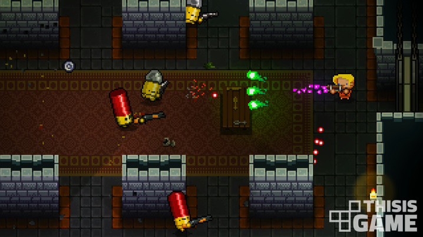
- 동영상
  [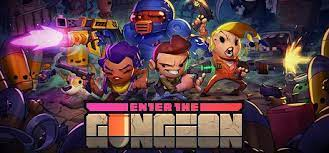](https://youtu.be/J3kPMRA_JYE?si=l33e1PuPjeiJKYj_)

  

# [대표 이미지]

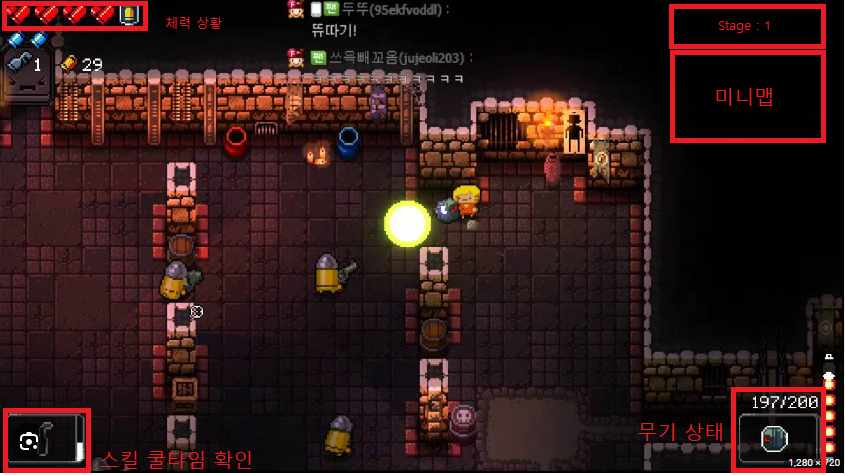

  

# [컨셉 and 대표이미지 기반 작품묘사]

> ### 대표이미지 기반 :지형과 오브젝트에 몸을 숨겨 총알을 피하며 적을 제압하는 게임입니다. 

> ### 컨셉 기반:액션게임은 플레이어가 플레이를 하며 짧은 시간에 가장 큰 재미를 느낄 수 있는 장르라고 생각을 했으며 여기에 예전부터 흥미를 가졌던 서부시대라는 배경을 더함으로서 가볍지만 쉽게 몰입할 수 있는 게임이라고 느껴지게 함을 목표로 개발합니다.

  

# [건슬링어 구성 요소]

- Fast is fine, but accuracy is final (빠른 것은 최선이지만, 정확한 것은 최고다).
- OK목장 결투의 주인공의 대사. 사격을 하는 자들이 항상 생각하는 금언이다.

 

## 1. 메커니즘

[도전 과제]

1. 스테이지마다 정해진 적이 출현한다
2. 특정 스테이지를 클리어 하면 다른 무기 해금
3. 피탄 가능한 횟수는 정해져 있음 ( 5개로 예상중)
4. 특정 스테이지에는 네임드가 존재하며 최종 스테이지는 보스가 존재

[재미 요소]

1. 무기마다 사거리, 탄의 종류, 재장전 속도 등이 다르다
2. 스페이스바로 회피를 할 수 있으며 엄폐물 등을 사용해야 한다.
3. 다수의 적을 한번에 처치할 수 있는 스킬 존재
4. 마우스로 적을 정확히 조준해서 사격

 

## 2. 이야기

[만들게 된 배경]  
간단하면서 재미있는 게임은 무엇일까 라는 고민을 방학동안 했습니다. 플랫포머, 어드밴처, 로그라이크 등 여러 고민을 했지만 제가 생각하기에 가장 직관적이면서 쉽게 재미를 느꼇던 부분은 슈팅액션이라고 생각하게 되었습니다. 그리고 레드 데드 리뎀션2를 플레이 한 경험에서 서부시대에 대한 간접적인 체험이 긍정적인 기억으로 남아서 만들게 되었습니다.
게임 내에서 스토리의 일부분을 글로 보여준 후 전투 스테이지를 하고 다시 이야기를 보여주는 방향으로 진행 될 예정입니다. 

[참신함]  
스킬 시스템을 넣어서 위기 상황에 도움이 되도록 구현할 예정입니다.

[카메라 관점]  
카메라는 탑뷰로 진행될 예정이며 플레이어를 따라 움직일 계획입니다. 개인적으로는 달리는 기차에서 진행되는 하나의 스테이지를 계획하고 있는데 이 스테이지는 카메라 위치가 상하 고정에 좌우로만 움직이도록 구현하고 싶습니다.

 

## 3. 미적요소

[디자인]  
서부시대 배경은 설원, 사막, 초원, 도시 등 다양한 배경이 있습니다. 기본적으로 초원 또는 사막배경의 맵을 디자인 할 예정이며 역량이 된다면 설원과 도시도 디자인 해보고 싶습니다. 전투시 적 또는 플레이어의 총알에 피탄된 엄폐물 또는 오브젝트는 흔적이 남도록 만들고 싶습니다. 캐릭터 등의 오브젝트는 전부 2D로 제작할 예정입니다.

[컬러]  
컬러는 기본적으로 황색,갈색,붉은색의 디자인 컬러를 사용할 예정이며 스테이지의 배경이 되는 환경의 색에 맞춰서 디자인 할 예정입니다.

[음향]  
기본적으로 총기마다 다른 격발음과 적대NPC와 플레이어의 사망시 음성, 회피 및 스킬을 사용할 때 나오는 소리등을 사용할 예정입니다. 메인메뉴 배경음은 서부시대 매체에서 흔히 나오는 소리와 비슷한 종류를 사용할 예정입니다.
 

## 4. 기술

Unity를 사용해서 제작할 예정이며 저사양의 PC를 가진 사람도 가능하도록 만들 예정입니다. 에셋을 최대한 사용하는 방향으로 제작하며 필요한 경우 직접 그래픽 디자인을 할 예정입니다.

# [게임 시스템 디자인]
## 1. 게임 오브젝트 분해

|연번|오브젝트 이름|오브젝트 이미지|
|:----:|:----:|:----:|
|1|웨슬리|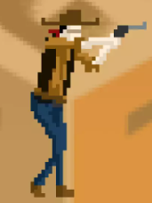|
|2|강도|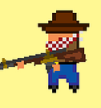|
|3|스캐빈저|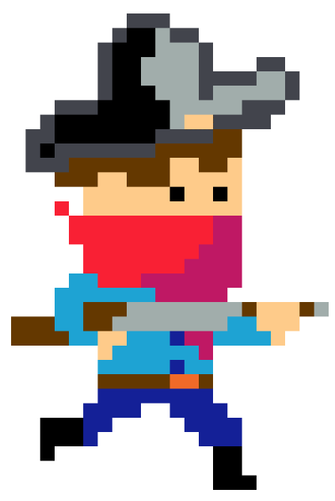|
|4|윌리엄|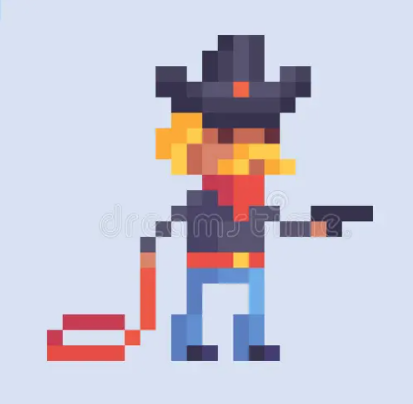|
|5|벤|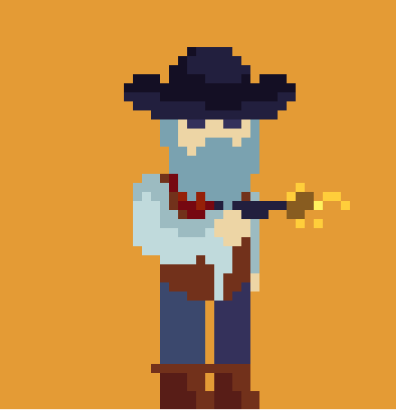|
|6|하비|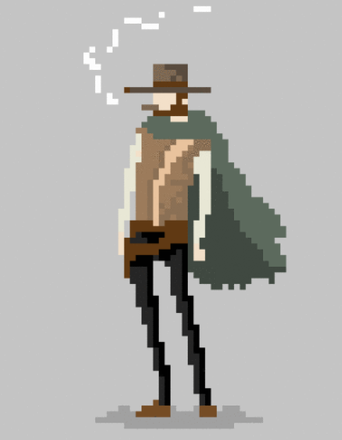|
|7|해리|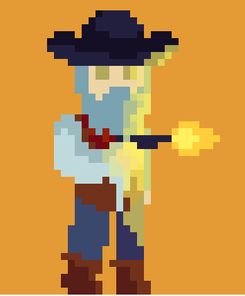|
|8|로버트|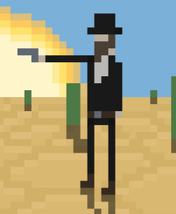|
|9|리볼버|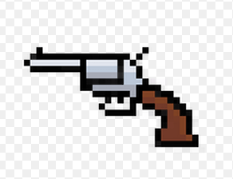|
|10|라이플|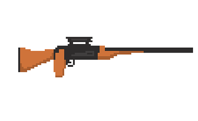|
|11|샷건|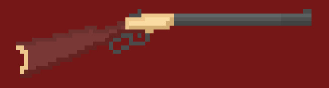|
|12|상자|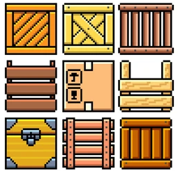|
|13|벽|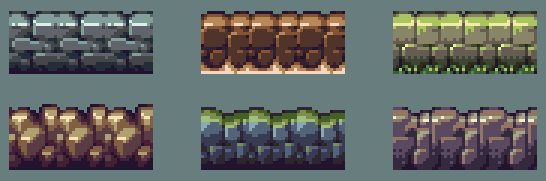|
|14|울타리|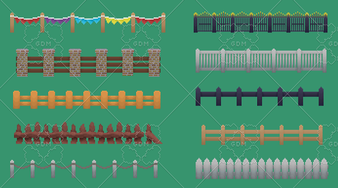|
|15|기둥||
|16|오크통|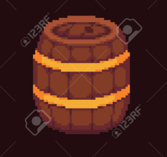|
|17|체력바|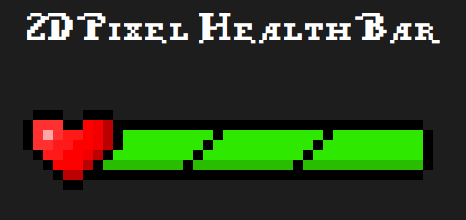|
|18|현재 무기 상황|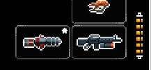|
|19|스킬UI|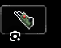|
|20|미니맵|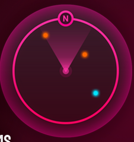|
|21|스테이지 표시||

## 2. 파라미터(속성) 뽑아 보기
1. 오브젝트 이름 :강도(Robber),스캐빈저(Scavenger)

|속성|영문명칭|설명|비고|
|:----:|:----:|:----:|:----:|
|체력|ehp|적 오브젝트의 체력||
|이동속도|espped|적 오브젝트의 이동속도||
|상태|eStatus|적 오브젝트의 상태(이동 , 공격, 등)||
|공격력|eATK|적 오브젝트 공격력||

2. 오브젝트 이름 :보스강도(윌리엄,벤,하비,해리,로버트)

|속성|영문명칭|설명|비고|
|:----:|:----:|:----:|:----:|
|체력|bhp|적 보스 오브젝트의 체력||
|이동속도|bspped|적 보스 오브젝트의 이동속도||
|상태|bStatus|적 보스 오브젝트의 상태(이동 , 공격, 등)||
|공격력|bATK|적 보스 오브젝트 공격력||

3. 오브젝트 이름 :리볼버,라이플,샷건

|속성|영문명칭|설명|비고|
|:----:|:----:|:----:|:----:|
|현재 장탄수|cMCap|현재 무기에 장전되어 있는 탄피 개수||
|최대 장탄수|mCap|최대 무기에 장전할 수 있는 탄피 개수||
|공격력|atk|무기 공격력||
|공격속도|ats|무기 공격속도||
|1회 공격시 총알 갯수|nBullet|1회 격발시 공격하는 총알 개수||

4. 오브젝트 이름 :미니맵(Mini Map)

|속성|영문명칭|설명|비고|
|:----:|:----:|:----:|:----:|
|플레이어의 위치|pPosition|플레이어의 위치||
|적의 위치|ePosition|적 오브젝트의 위치||
|플레이어의 회전값|pRotation|플레이어의 로테이션 값||

## 3. 행동 뽑아 보기

1. 오브젝트 이름 :웨슬리(Wesley)
   
|행동|영문명칭|설명|
|:----:|:----:|:----:|
|대기|Idle|대기상태|
|공격|Attack|공격상태|
|이동|Move|이동하는 상태|
|이동하며 공격|Moving Attack|이동하며 공격하는 상태|
|구르기|Rolling|구르는 상태|
|스킬|Skill|스킬을 사용하는 상태|

2. 오브젝트 이름 :강도(Robber),스캐빈저(Scavenger)
   
|행동|영문명칭|설명|
|:----:|:----:|:----:|
|대기|Idle|대기상태|
|이동|Move|이동하는 상태|
|공격|Attack|공격상태|

3. 오브젝트 이름 :보스강도(윌리엄,벤,하비,해리,로버트)
   
|행동|영문명칭|설명|
|:----:|:----:|:----:|
|대기|Idle|대기상태|
|이동|Move|이동하는 상태|
|공격|Attack|공격상태|

## 4. 상태 뽑아 보기

1. 오브젝트 이름 :웨슬리(Wesley)
   
|현상대|전이상태|전이조건|
|:----:|:----:|:----:|
|대기|대기|아무 행동도 하지 않음|
|대기|이동|상하좌우 이동에 대응하는 버튼 입력|
|대기|구르기|스페이스바 키 입력|
|대기|공격|마우스 왼쪽 버튼 좌측 클릭|
|대기|필살기|Shift 키 입력|
|대기|구르기|이동중 스페이스바 키 입력|
|이동|이동하며 공격|이동중 공격키 입력|
|이동|필살기|이동중 Shift 키 입력|

2. 오브젝트 이름 :강도(Robber),스캐빈저(Scavenger)
   
|현상대|전이상태|전이조건|
|:----:|:----:|:----:|
|대기|대기|아무 행동도 하지 않음|
|대기|이동|대기상태에서 일정 시간이 지난 후 랜덤으로|
|대기|공격|대기상태에서 일정 시간이 지난 후 랜덤으로|

3. 오브젝트 이름 :보스강도(윌리엄,벤,하비,해리,로버트)
   
|현상대|전이상태|전이조건|
|:----:|:----:|:----:|
|대기|대기|아무 행동도 하지 않음|
|대기|이동|대기상태에서 일정 시간이 지난 후 랜덤으로|
|대기|공격|대기상태에서 일정 시간이 지난 후 랜덤으로|

## 5. 플레이어 캐릭터 속성(파라미터)

|속성|영문명칭|설명|비고|
|:----:|:----:|:----:|:----:|
|체력|php|플레이어 체력||
|이동속도|speed|플레이어 이동속도||
|상태|pStatus|플레이어 상대(구르기중인지 스킬사용중인지 등)||
|스킬 쿨타임|skillCooltime|플레이어 스킬의 쿨타임||
|현재 무기|eWeapon|플레이어가 현재 장착한 무기||

## 6. 게임의 규칙
1) 핵심 규칙
플레이어는 선형적인 게임의 줄거리 및 스테이지를 진행하게 됨
플레이어는 주인공 캐릭터인 웨슬리를 조작해 적대 캐릭터 및 특정 스테이지에서 등장하는 보스 캐릭터를 물리치고 최종적인 승리자가 되어야 함
스테이지는 1 스테이지에서 특정 숫자의 적이 등장하며 이를 주어진 무기를 가지고 적응 제압하는 방식으로 진행되며 3의 배수의 스테이지마다 보스가 등장하며 보스는 1명 이상이 등장하게 됨
플레이어는 WASD 키로 조작하게 하며 마우스를 움직어 적을 조준하며 마우스 좌클릭으로 총을 발사할 것임
또 스테이지를 진행하며 다른 무기를 획득하게 되며 원하는 때에 무기를 교체하며 전투를 진행하게 됨
총알에 대한 개념 및 시스템이 적용될 예정이며 이를 통해 플레이어는 재장전을 요구받게 되며 단순히 적을 학살하는 것이 아니라 필요한 때에 엄폐물에 숨는 등의 전략적인 플레이가 가능함
플레이어는 스킬 사용이 가능하며 이는 자주 쓸 수 없지만 다수의 적을 한번에 제압하게 함으로 위기 상황에서 큰 도움이 되도록 설계
미니맵을 통해 적대 캐릭터의 위치를 확인할 수 있게 만들어 적대 캐릭터의 위치를 몰라 스테이지를 클리어 할 수 없게 만들지는 않을 것임

2) 보조 규칙
만약 적 캐릭터와 플레이어 캐릭터가 동시에 사망하는 판정이 나오게 될 경우 클리어로 인정되지 않음

## 7. 게임에서 사용될 공식

|공식|사용처|
|:----:|:----:|
|php -= bATK|플레이어가 보스에게 공격당했을 시|
|php -= eATK|플레이어가 일반 적에게 공격당했을 시|
|ehp -= Attack|일반 적이 플레이어에게 공격당했을 시|
|bhp -= Attack|보스가 플레이어에게 공격당했을 시|

# [개발 요구사항 & 흐름도]  
## 1. 요구사항  

1. 플레이어 WASD 이동 구현(상하좌우)
2. 플레이어를 중심점으로 하는 마우스 위치에 따른 총기 회전 구현
3. 플레이어 공격 구현(마우스 좌클릭으로 공격하며 총알은 일정한 속도로 마우스 위치의 방향을 향해 나아가며 일정 시간이 지나거나 장애물 등의 다른 오브젝트와 충돌하면 삭제된다.)
4. 플레이어 공격 딜레이 구현(무기마다 다른 공격 딜레이를 가지도록한다)
5. 마우스 위치에 조준선 구현(십자모양에 원이 감싼 모양)
6. 플레이어 무기 3종류 구현(리볼버,샷건,라이플)
7. 플레이어 무기에 따른 총알 제한 및 재장전 구현(리볼버 6발, 샷건 2발, 라이플 8발)
8. 총알이 막히는 엄폐물 구현(박스,벽,기둥,건물 등)
9. 플레이어 Space 구르기 구현(구르는 동안에 무적타임 존재)
10. 플레이어 Shift 스킬 구현(오버워치 캐서디 궁극기 또는 레드 데드 리뎀션2의 데드아이 등)
11. 플레이어 Shift 스킬의 쿨타임 구현
12. 적대 캐릭터 이동 구현(적대 캐릭터 최대 공격 사거리 내부로)
13. 적대 캐릭터 공격 구현(탄막식으로 할지 타이밍을 맞춰서 피할지)
14. 적대 캐릭터와 플레이어의 피격판정 및 데미지 공식 구현
15. 화면 우측 상단에 미니맵을 생성(플레이어를 중심으로 또는 스테이지 중앙을 중심으로 하는)
16. 화면 좌측 상단에 플레이어 체력등을 표시해주는 UI 제작
17. 화면 좌측 하단에 스킬의 쿨타임을 표시하는 UI 제작
18. 화면 우측 하단에 플레이어 무기 상태를 표시하는 UI 제작
19. 플레이어 체력이 위험상태(30%이하)가 된다면 게임 화면이 전체적으로 붉은 색을 띄도록 제작
20. 스테이지는 총 12스테이지로 제작 (스테이지는 순서대로 진행이 된다. 3의 배수 스테이지마다 보스 스테이지가 있다.)
21. 스테이지 클리어에 실패해 게임오버를 당하게 된 경우 시작메뉴로 돌아갈지 해당 스테이지를 다시 도전할지 선택할 수 있다. 시작화면으로 돌아간 경우 다시 게임을 하면 1스테이지부터 진행해야하며 전에 플레이 하던 지점부터 이어할 수는 없다.
22. 캐릭터 외형 디자인(에셋을 활용하거나 에셋이 없다면 직접 디자인, 주인공,스캐빈저,강도,보스5종)
23. 각 무기의 공격 및 적대 캐릭터의 공격에 맞는 적절한 사운드 삽입
24. 메인 BGM 삽입
25. ESC버튼을 누를 시 일지정지 및 메뉴UI가 활성화 되도록 UI 제작
26. 보스 캐릭터 체력을 표시해주는 UI 생성(화면 중앙 하단에 생성되도록 함)
27. 시작화면, 엔딩화면 구현
28. 키 조작을 알려주는 UI 구현
29. 플레이어와 타 캐릭터간 대화문 제작 및 삽입(대화문은 화면 중앙 하단에 나타남)
    
## 2. 시간별 흐름도 flowchart  
  

## 3. 키보드 이벤트에 대한 흐름도  
  

## 4. 용어정리 
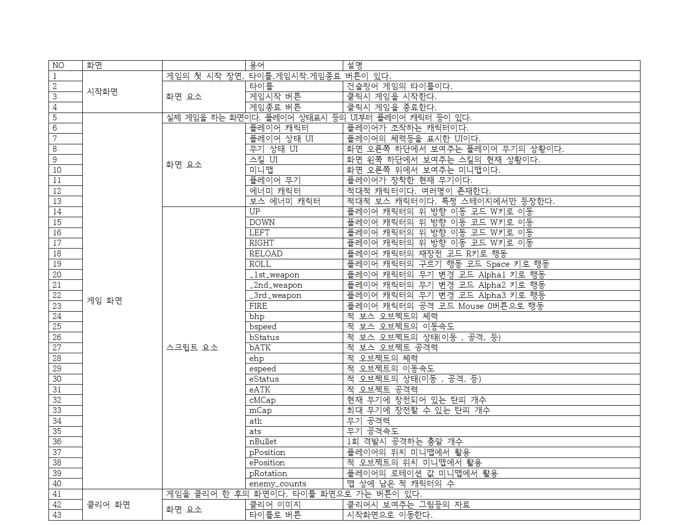  

# 스토리보드  
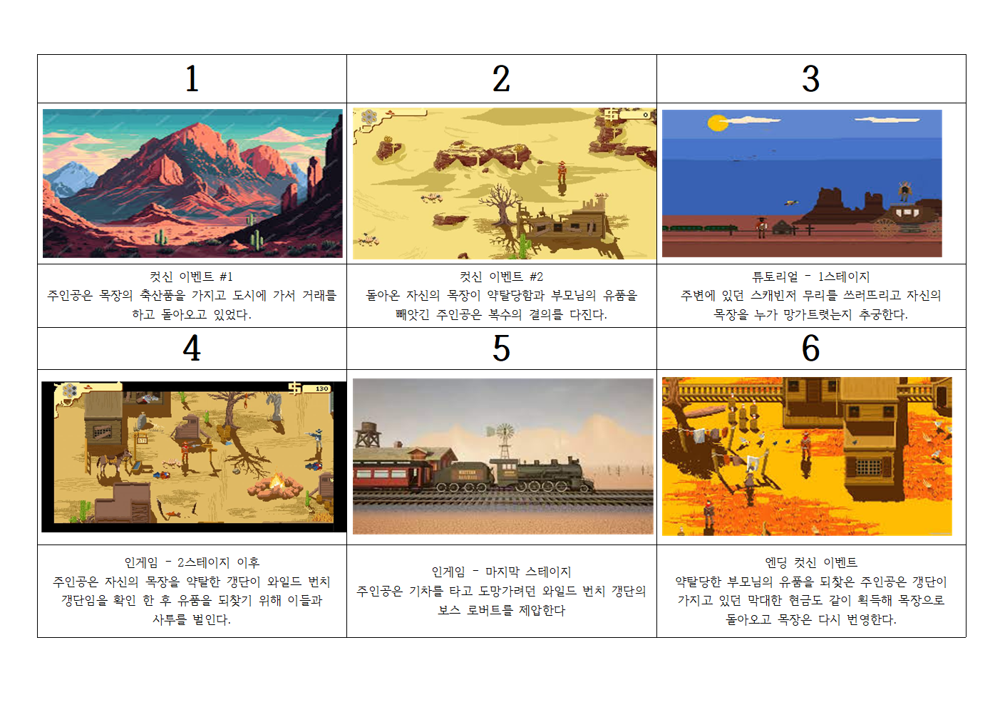  

