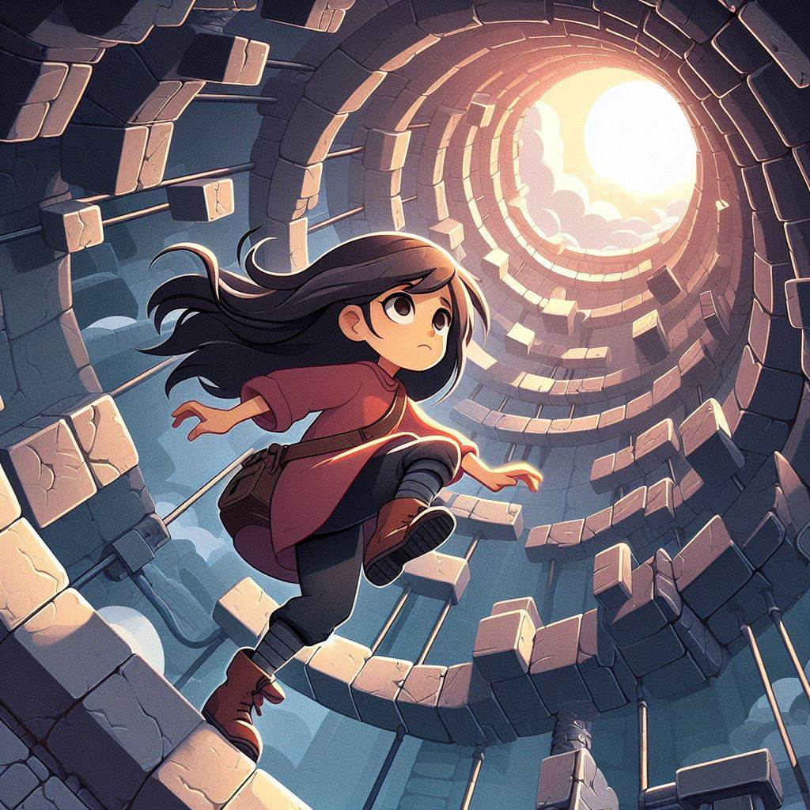

# 건슬링어 (2188043 윤진호)

# [목차]
>1.[프로젝트명 : Soar](#프로젝트명-Soar)  

>2.[컨셉](#컨셉)   

>3.[관련 이미지 and 동영상](#관련-이미지-and-동영상)   

>4.[대표 이미지](#대표-이미지)
   
>5.[컨셉 and 대표이미지 기반 작품 묘사](#컨셉-and-대표이미지-기반-작품묘사)
   
>6.[게임의 규칙](#게임의-규칙)

>7.[개발 요구사항](#개발-요구사항)    

>8.[개발일지](#개발일지)  
# 프로젝트명: Soar

# [컨셉]

## 메인컨셉 :

- 플랫포머 게임은 대부분의 연령층에게 쉽고 직관적으로 다가가며 게임의 플레이 방식을 빠르게 파악하는데 좋아 접근성이 좋으며 제작자의 개발 의도에 따라 난이도도 천차만별로 달라지기 때문에 메인 컨셉을 플랫포머 게임으로 정했습니다.

### 서브 컨셉 1 :

- 등반 : 아래에서 물이 천천히 차오르는 탑에 갇힌 소녀가 탈출을 위해 탑을 오른다는 설정입니다.

### 서브 컨셉 2 :

- 함정 : 플랫포머 게임의 필수적인 요소로 플레이어가 방심을 하거나 거리계산을 실수한다면 플레이어를 맵 아래로 떨어트릴 요소입니다.

### 서브 컨셉 3 :

- 추락 : 함정에 피격되서 게임오버 되는 상황은 없고 대신 피격이 되면 지면에 떨어지고 일정 시간이 있어야 초기 상태로 회복이 되게 만들 예정입니다.

### 서브 컨셉 4 :

- 기울기 : 단조로운 플레이를 없애고 위기 상황을 자연스럽게 만드는데 도움이 될 요소로, 맵이 정직하게 있는 것이 아니라 –45~45도를 계속 왔다갔다 하며 맵이 움직입니다. 그에 따라 지형지물의 위치등이 바뀌게 됩니다.

  

# [관련 이미지 and 동영상]

- 이미지  
  
- 동영상
  

  

# [대표 이미지]

  

# [컨셉 and 대표이미지 기반 작품묘사]

> ### 대표이미지 기반 :대표 이미지는 주인공이 계속 기울어지는 탑을 발판을 밟고 오르는 모습을 묘사했습니다.

> ### 컨셉 기반:플랫포머 게임으로 주인공은 계속 좌 우로 기우는 탑을 올라야 합니다. 함정을 피해 발판을 밟거나 벽을 차서 오르며 가끔 실수를 해 아래로 떨어지기도 합니다.

  

# [건슬링어 구성 요소]

 

## 1. 메커니즘

[도전 과제]

1. 기울기의 추가로 타 플랫포머보다 변수가 있는 플랫포머
2. 다양한 함정을 회피

[재미 요소]

1. 계속 기울어 지는 탑으로 인해 타이밍을 맞춰서 가야 할 때가 있다.
2. 벽 타는 것을 활용해야한다.
3. 아기자기한 도트그래픽

 

## 2. 이야기

[만들게 된 배경]  
간단하면서 재미있는 게임은 무엇일까 라는 고민을 방학동안 했습니다. 플랫포머가 좋겠다고 생각해서 방학동안 자료 수집을 했으며 점프킹, Unstable Cylinder등의 게임에서 영감을 받아 제작하게 되었습니다.
[참신함]  
게임 시작후 바로 카메라 각도가 변환을 시작해서 화면이 기울어지는 느낌을 주게 만들었습니다. 그리고 화면이 기울어짐에 따라서 중력도 조정해서 맵의 변화가 실감나도록 만들었습니다.

[카메라 관점]  
카메라는 사이드뷰로 진행되며 플레이어를 따라 움직입니다.

 

## 3. 미적요소

[디자인]  
도트 그래픽으로 제작할 예정이며 가능하면 에셋을 활용하고 필요하면 직접 제작할 계획입니다.

[컬러]  
너무 밝고 화려한 색은 눈의 피로방지를 위해 가급적 회피할 예정이며 탑 내부이기 때문에 어두운 색으로 표현했습니다..

[음향]  
어두운 느낌의 BGM을 사용할 예정이며 점프 효과음을 넣었습니다.
 

## 4. 기술

Unity를 사용해서 제작할 예정이며 저사양의 PC를 가진 사람도 가능하도록 만들 예정입니다. 에셋을 최대한 사용하는 방향으로 제작하며 필요한 경우 직접 그래픽 디자인을 할 예정입니다.

## 5. 게임의 규칙
1) 핵심 규칙
플레이어는 기울기가 계속 변하는 탑을 오르게 됨
플레이어 사망은 없으며 함정에 당하면 넉백 및 기절을 당해 아래로 떨어지게 됨
계속 떨어지면 시작지점 (태초마을)까지 떨어지게 만들 예정
다양한 함정이 존재하며 플레이어는 해당 함정들을 피해야 함
벽타기가 가능하며 같은 벽을 연속으로 타는 것은 불가
제한시간은 존재하지 않음
세이브 포인트 없음

2) 보조 규칙
A,D키 또는 좌우 방향키로 좌우만 이동 가능
스페이스바키로 점프

## 6. 개발 요구사항

1) 플레이타임은 5분~10분이 되게 한다.
2) 플레이어는 탑을 오르며 함정에 당해도 게임오버 하지 않지만 함정에 피격되면 일시적으로 조작이 불가능 한 상태로 넉백당한다. 단 아래에서 차오르는 물에 닿으면 게임오버된다.
3) 플레이어 조작은 키보드 A,D 또는 화살표 좌우 버튼으로 왼쪽 오른쪽 이동이 가능하며 점프는 스페이스키로 가능하다.
4) 플레이어는 2단 점프가 가능하다.
5) 플레이어 캐릭터 디자인
6) 캐릭터의 조작불가 상태는 피격 후 일정 시간이 지난 후 회복한다.
7) 함정은 2가지 이상으로 구현한다.
8) 함정은 공격에 일정 텀이 있어야 하고 떨어지는 함정의 경우 일정 시간이 지나면 리스폰 되도록 만든다.
9) 중간에 게임을 그만하고 다시 시작하면 처음부터 시작
10) 맵은 계속해서 좌 우로 흔들린다. -45~45도를 계속 반복하며 맵의 기울기가 변한다.
11) 메인 BGM 삽입
12) 캐릭터 효과음 삽입
13) 골인 지점에 도달하면 엔딩 씬으로 전환한다.
14) Start씬, Ending씬, Clear씬 구현
15) 맵은 타일맵을 활용해서 디자인 하도록 한다.

# 개발일지  

## 1주차

1. 오리엔테이션

## 2주차

1. 설계보고서 제출

## 3주차

1. 플레이어 조작은 키보드 A,D 또는 화살표 좌우 버튼으로 왼쪽 오른쪽 이동이 가능하며 점프는 스페이스키로 가능하다. (3) 80%

## 4주차

1. 플레이어 조작은 키보드 A,D 또는 화살표 좌우 버튼으로 왼쪽 오른쪽 이동이 가능하며 점프는 스페이스키로 가능하다. (3) 80%
2. 맵은 계속해서 좌 우로 흔들린다. -45~45도를 계속 반복하며 맵의 기울기가 변한다. (10) 100%

## 5주차

1. 플레이어 조작은 키보드 A,D 또는 화살표 좌우 버튼으로 왼쪽 오른쪽 이동이 가능하며 점프는 스페이스키로 가능하다. (3) 100%
2. 플레이어는 2단 점프가 가능하다. (4) 100%

## 6주차

1. 플레이어 캐릭터 디자인 25% (5)
2. 10) 맵은 계속해서 좌 우로 흔들린다. -45~45도를 계속 반복하며 맵의 기울기가 변한다. 50% (10)

## 7주차

1. 플레이어 캐릭터 디자인 50% (5)
2. 맵은 계속해서 좌 우로 흔들린다. -45~45도를 계속 반복하며 맵의 기울기가 변한다. 100% (10)
3. 맵은 타일맵을 활용해서 디자인 하도록 한다. 100% (15)
4. 메인 BGM 삽입 100% (11)

## 8주차

1. 플레이어 캐릭터 디자인 100% (5)
2. 캐릭터 효과음 삽입 100% (12)

## 9주차

진행사항 없음

## 10주차

1. 함정은 2가지 이상으로 구현한다. 50% (7)
2. 캐릭터의 조작불가 상태는 피격 후 일정 시간이 지난 후 회복한다. 100% (6)

## 11주차

1. 함정은 2가지 이상으로 구현한다. 100% (7)
2. 플레이어는 탑을 오르며 함정에 당해도 게임오버 하지 않지만 함정에 피격되면 일시적으로 조작이 불가능 한 상태로 넉백당한다. 단 아래에서 차오르는 물에 닿으면 게임오버된다. 100% (2)

## 12주차

1. 플레이타임은 5분~10분이 되게 한다. 100% (1)
2. 함정은 공격에 일정 텀이 있어야 하고 떨어지는 함정의 경우 일정 시간이 지나면 리스폰 되도록 만든다. 100% (8)
.
## 13주차

1. Start씬, Ending씬, Clear씬 구현 100% (14)
2. 중간에 게임을 그만하고 다시 시작하면 처음부터 시작 100% (9)
3. 골인 지점에 도달하면 엔딩 씬으로 전환한다. 100% (13)
4. 디버깅 

