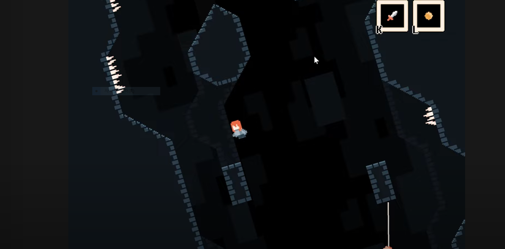

# 프로젝트명: 건슬링어
2188043 윤진호

# [컨셉]

## 메인컨셉 :

- 액션게임은 플레이어가 플레이를 하며 짧은 시간에 가장 큰 재미를 느낄 수 있는 장르라고 생각을 했으며 여기에 예전부터 흥미를 가졌던 서부시대라는 배경을 더함으로서 가볍지만 쉽게 몰입할 수 있는 게임이라고 느껴지게 함

### 서브 컨셉 1 :

- 서부 : 총을 사용해서 적과 싸운다는 컨셉입니다. 역사적으로도 있었던 시기이기 때문에 플레이어와 적이 싸우는 이유를 쉽게 생각할 수 있으며 플레이어의 몰입을 도울 수 있다고 생각합니다.

### 서브 컨셉 2 :

- 장전 : 플레이어 캐릭터와 적대 NPC의 딜레이 및 제한이 없는 공격은 몰입감을 해칠 수 있다고 생각했습니다. 그래서 플레이어와 적 모두 일정 횟수를 공격하면 재장전을 해야하도록 만들 예정입니다.

### 서브 컨셉 3 :

- 회피 : 스페이스바를 사용해서 적의 총알을 회피 (연속해서 사용해도 무적은 되지 않도록 조절)

### 서브 컨셉 4 :

- 스킬 : 단조로운 플레이를 없애고 위기 상황에서 역전등을 하기 위한 전략적인 요소 추가를 위해 추가 (레드 데드 리뎀션2의 데드아이 또는 오버워치2의 캐서디의 궁극기와 비슷한 방향으로 추가)

### 서브 컨셉 5 :

- 엄폐물 : 몸을 숨길 수 있는 엄폐물 등을 추가해서 플레이어가 잠시 쉬면서 전략을 구상하거나 하도록 만들 예정이며 또 엄폐물의 존재 덕분에 플레이어의 체력을 아주 높게 설정하지 않도록 만들 수 있다고 생각합니다.

  

# [관련 이미지 & 동영상]

- 이미지  
  
- 동영상
  

  

# [대표 이미지]

  

# [컨셉 & 대표이미지 기반 작품묘사]

> ### 대표이미지 기반 :

> ### 컨셉 기반:

  

# [<건슬링어> 구성 요소]

- Fast is fine, but accuracy is final (빠른 것은 최선이지만, 정확한 것은 최고다).
- OK목장 결투의 주인공의 대사. 사격을 하는 자들이 항상 생각하는 금언이다.

 

## 1. 메커니즘

[도전 과제]

1. 스테이지마다 정해진 적이 출현한다
2. 특정 스테이지를 클리어 하면 다른 무기 해금
3. 피탄 가능한 횟수는 정해져 있음 ( 5개로 예상중)
4. 특정 스테이지에는 네임드가 존재하며 최종 스테이지는 보스가 존재

[재미 요소]

1. 무기마다 사거리, 탄의 종류, 재장전 속도 등이 다르다
2. 스페이스바로 회피를 할 수 있으며 엄폐물 등을 사용해야 한다.
3. 다수의 적을 한번에 처치할 수 있는 스킬 존재
4. 마우스로 적을 정확히 조준해서 사격

 

## 2. 이야기

[만들게 된 배경]  
간단하면서 재미있는 게임은 무엇일까 라는 고민을 방학동안 했습니다. 플랫포머, 어드밴처, 로그라이크 등 여러 고민을 했지만 제가 생각하기에 가장 직관적이면서 쉽게 재미를 느꼇던 부분은 슈팅액션이라고 생각하게 되었습니다. 그리고 레드 데드 리뎀션2를 플레이 한 경험에서 서부시대에 대한 간접적인 체험이 긍정적인 기억으로 남아서 만들게 되었습니다.
게임 내에서 스토리의 일부분을 글로 보여준 후 전투 스테이지를 하고 다시 이야기를 보여주는 방향으로 진행 될 예정입니다. 

[참신함]  
스킬 시스템을 넣어서 위기 상황에 도움이 되도록 구현할 예정입니다.

[카메라 관점]  
카메라는 탑뷰로 진행될 예정이며 플레이어를 따라 움직일 계획입니다. 개인적으로는 달리는 기차에서 진행되는 하나의 스테이지를 계획하고 있는데 이 스테이지는 카메라 위치가 상하 고정에 좌우로만 움직이도록 구현하고 싶습니다.

 

## 3. 미적요소

[디자인]  
서부시대 배경은 설원, 사막, 초원, 도시 등 다양한 배경이 있습니다. 기본적으로 초원 또는 사막배경의 맵을 디자인 할 예정이며 역량이 된다면 설원과 도시도 디자인 해보고 싶습니다. 전투시 적 또는 플레이어의 총알에 피탄된 엄폐물 또는 오브젝트는 흔적이 남도록 만들고 싶습니다. 캐릭터 등의 오브젝트는 전부 2D로 제작할 예정입니다.

[컬러]  
컬러는 기본적으로 황색,갈색,붉은색의 디자인 컬러를 사용할 예정이며 스테이지의 배경이 되는 환경의 색에 맞춰서 디자인 할 예정입니다.

[음향]  
기본적으로 총기마다 다른 격발음과 적대NPC와 플레이어의 사망시 음성, 회피 및 스킬을 사용할 때 나오는 소리등을 사용할 예정입니다. 메인메뉴 배경음은 서부시대 매체에서 흔히 나오는 소리와 비슷한 종류를 사용할 예정입니다.
 

## 4. 기술

Unity를 사용해서 제작할 예정이며 저사양의 PC를 가진 사람도 가능하도록 만들 예정입니다. 에셋을 최대한 사용하는 방향으로 제작하며 필요한 경우 직접 그래픽 디자인을 할 예정입니다.
